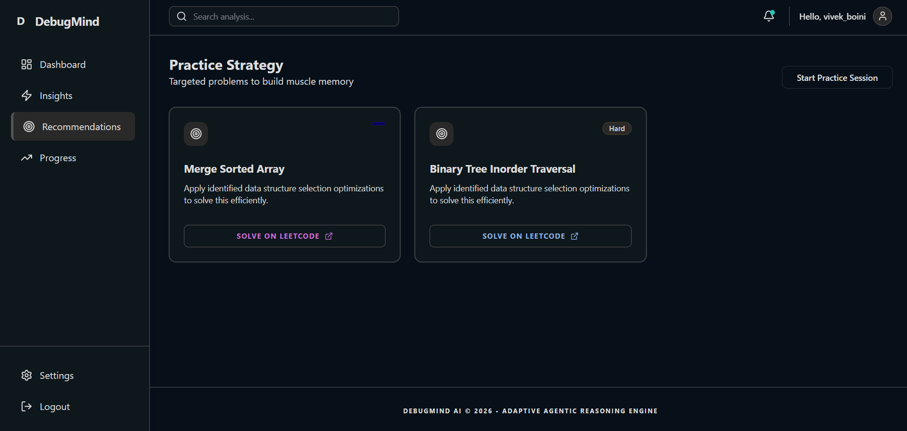

# DebugMind AI – Personalized Coding Feedback System

DebugMind AI is an agentic learning mentor designed to transform how developers improve their coding performance. By extracting your LeetCode submissions, it analyzes code patterns, detects weaknesses, and provides targeted recommendations via a professional dashboard.

---

## 🚀 Architecture & Data Flow

**Architecture:**
Chrome Extension → Backend → Analysis Engine → Dashboard

**Data Flow:**
User clicks extract on LeetCode → Submissions fetched → Backend processes → UI shows insights

---

## ✨ Features

- **LeetCode submission extraction**
- **GraphQL integration**
- **Weakness detection**
- **Skill heatmap**
- **Recommendations**
- **Progress tracking**

---

## 🛠 Tech Stack

- **Frontend:** React, Tailwind CSS
- **Backend:** Node.js, Express
- **Extension:** Chrome Extension (Manifest V3)
- **AI Layer:** Rule-based + LLM (Grok API)

---

## ⚙️ Setup Instructions

### 1. Backend Setup
```bash
cd backend
npm install
npm run dev # or npm start
```
*Creates the Express server listening on the configured port.*

### 2. Frontend Setup
```bash
cd frontend
npm install
npm run dev
```
*Starts the Vite React dashboard.*

### 3. Extension Setup
1. Open Chrome and navigate to `chrome://extensions/`
2. Enable **Developer mode** in the top right.
3. Click **Load unpacked** and select the `extension/` folder from this project.
4. Navigate to `https://leetcode.com/submissions/` to see the "Extract My Submissions" button.

---

## ⚠️ Disclaimer

*This project extracts only user-authorized data for educational purposes and does not perform large-scale scraping or violate platform policies.*


---

## 📸 Screenshots

| Dashboard Overview | Extension Integration | Conceptual Insights |
| :--- | :--- | :--- |
|  |  | (Dashboard showing detailed alerts) |

---

## 📌 Disclaimer

This project extracts only user-authorized data for educational purposes and does not perform large-scale scraping or violate platform policies. All extraction is triggered manually by the authenticated user.

---

*Built with ❤️ for better coding.*
