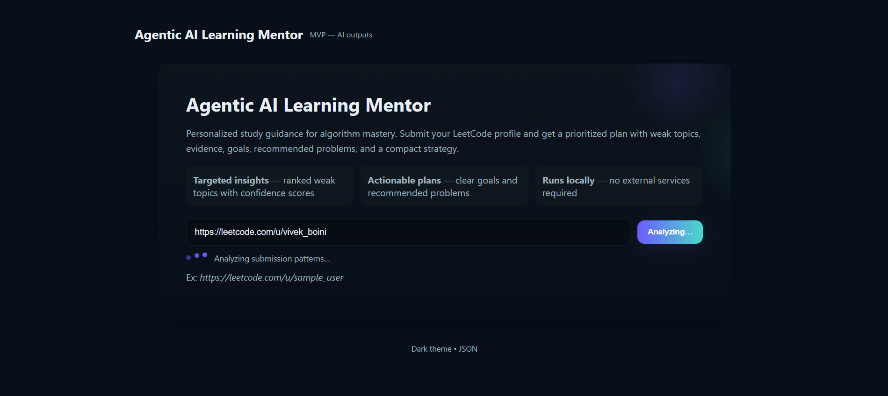
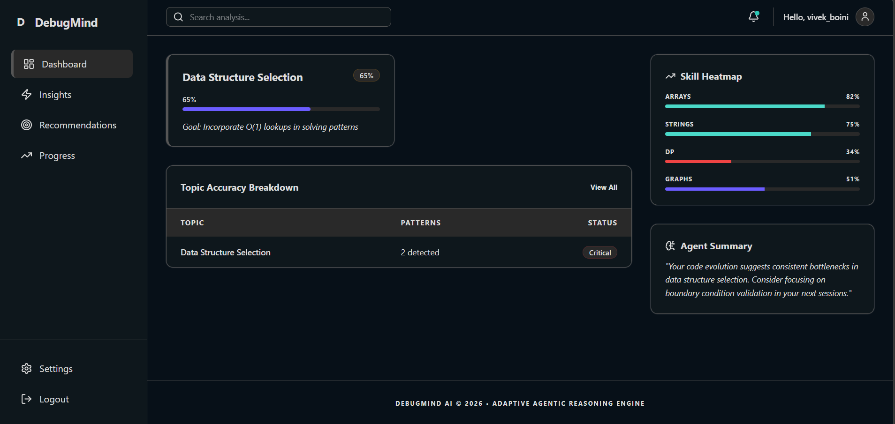

# 🧠 DebugMind AI — Agentic AI Learning Mentor (MVP)

DebugMind AI is an agentic learning system that analyzes LeetCode submission patterns and generates personalized improvement strategies.

Instead of evaluating only correctness, DebugMind:

- Detects conceptual weaknesses  
- Sets mastery goals  
- Assigns adaptive practice problems  
- Monitors progress  
- Runs a closed-loop improvement cycle  

---

## 🚀 Demo Overview

### 🔹 Home Screen – Profile Analysis


User enters a LeetCode profile URL and triggers AI analysis.

---

### 🔹 AI Agent Dashboard


The system displays:

- Ranked weak topics  
- Confidence scores  
- Evidence from submission patterns  
- Strategy summary  
- Agent timeline  
- Recommended problems  

---

## 🔁 Agent Loop Process

1. Diagnose weak topics from submission evolution  
2. Set mastery goals  
3. Assign practice strategy  
4. Monitor progress  
5. Adapt strategy if necessary  

This creates an autonomous improvement cycle.

---

## 🏗 Architecture
```
Frontend (React + Vite)
            ↓
Backend (Node.js + Express)
            ↓
Agentic Analysis Engine (Rule-Based Reasoning)
```


- The AI layer runs independently as a structured reasoning module.
- The MVP uses rule-based inference for explainability.
- No external services required in this version.

---

## 🛠 Tech Stack

- React (Frontend)
- Vite
- Node.js
- Express
- JSON-based AI simulation
- Dark theme UI

---

## ⚙️ Running Locally

### Backend

```
cd "DebugMind AI/backend"
npm install
npm start
```

### Frontend

```
cd "DebugMind AI/frontend"
npm install
npm run dev
```

## 📌 Notes

- This is an MVP prototype.
- AI output is simulated using structured rule-based reasoning.
- No external network calls are made.
- Fully modular and extendable into real submission analysis.

## 🔮 Future Enhancements

- Real-time LeetCode submission scraping
- AST-based structural code analysis
- Dynamic strategy adaptation
- Continuous monitoring agent
- Multi-language support
- Cloud deployment
